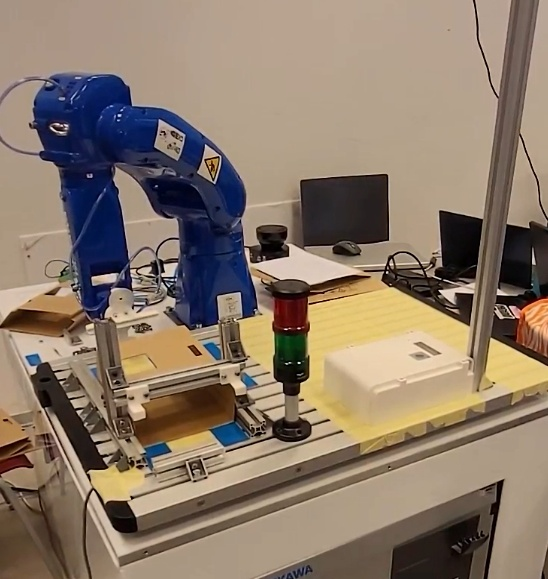
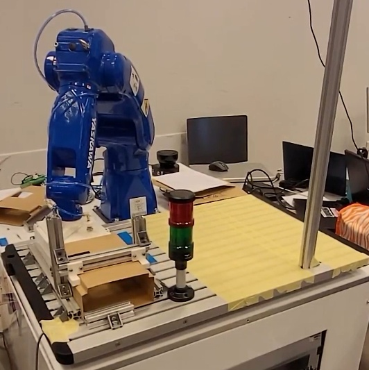

# DIR 2023

Proof of concept hackaton "Days of industrial robotics 2023" application for controling a Yaskawa GP-8 robot for packing products into foldable cardboard boxes. Implemented functionalities are as follows:

* Find objects - Finds the center of the two biggest area contours in a camera frame using Canny detector
* Grab detected object - Calculates the position of the object in robot cordinate space and grabs it (Not implemented)
* Insert object - Robot grabs the cardboard box, unfolds it, inserts the product and folds the edges of the box
* Pack object - Packs the product in folded cardboard box and places it on a pallet by specification (Half-way implemented, not working in app, works standalone)
* Stop robot - Stops the robot (Half way implemented)
* Scan QR - Scans the QR code and if the serial number is not in order prints an error

